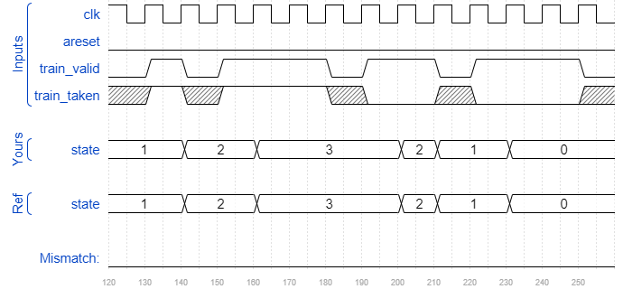

# Cs450/counter 2bc
### Solution
```Verilog
module top_module(
    input clk,
    input areset,
    input train_valid,
    input train_taken,
    output reg [1:0] state
);
    parameter SNT=2'd0, WNT=2'd1, WT=2'd2, ST=2'd3;
    reg [1:0] next_state;
    
    always @(posedge clk or posedge areset) begin
        if(areset) 
            state <= WNT;
        else if(train_valid)
            state <= next_state;
        else
            state <= state;
    end
    
    always @(*) begin
        case(state)
            SNT : next_state <= train_taken ? WNT : SNT;
            WNT : next_state <= train_taken ? WT : SNT;
            WT : next_state <= train_taken ? ST : WNT;
            ST : next_state <= train_taken ? ST : WT;
            default: next_state <= WNT;
        endcase
    end

endmodule
```
[code](./180.v)

### Timing diagrams for selected test cases




