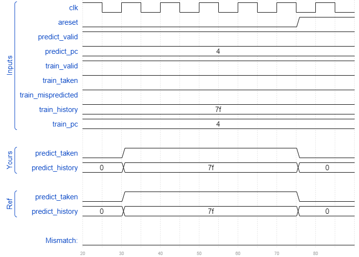
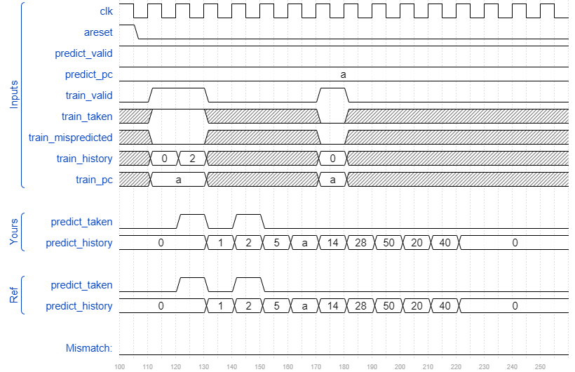
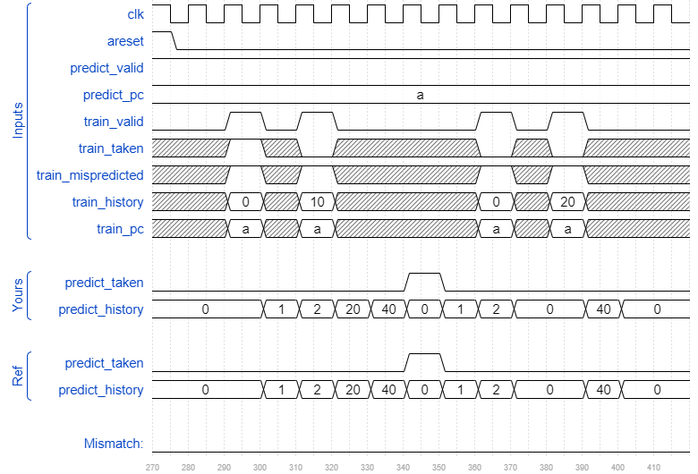

# Cs450/gshare
### Solution
```Verilog
module top_module(
    input clk,
    input areset,

    input  predict_valid,
    input  [6:0] predict_pc,
    output predict_taken,
    output reg [6:0] predict_history,

    input train_valid,
    input train_taken,
    input train_mispredicted,
    input [6:0] train_history,
    input [6:0] train_pc
);
    reg [1:0] PHT[127:0];
    
    always @(posedge clk or posedge areset) begin
        if (areset) begin
            predict_history <= 0;
            for (integer i = 0; i < 128; i = i + 1) 
                PHT[i] <= 2'b01;
        end
        else begin
            if (train_valid && train_mispredicted)
                predict_history <= {train_history[6:0], train_taken};
            else if (predict_valid)
                predict_history <= {predict_history[6:0], predict_taken};
            
            if (train_valid) begin
                if (train_taken)
                    PHT[train_history ^ train_pc] <= (PHT[train_history ^ train_pc] == 2'b11) ? 2'b11 : (PHT[train_history ^ train_pc] + 1);
            	else
                    PHT[train_history ^ train_pc] <= (PHT[train_history ^ train_pc] == 2'b00) ? 2'b00 : (PHT[train_history ^ train_pc] - 1);
            end
        end
    end
    
    assign predict_taken = PHT[predict_history ^ predict_pc][1];

endmodule
```
[code](./182.v)

### Timing diagrams for selected test cases







