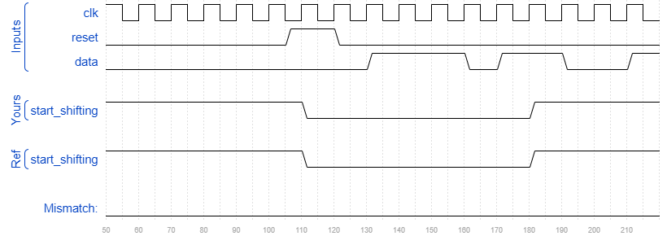

# Exams/review2015 fsmseq
### Solution
```Verilog
module top_module (
    input clk,
    input reset,      // Synchronous reset
    input data,
    output start_shifting);
    
    parameter IDLE=3'd0, S0 = 3'd1, S1=3'd2, S2=3'd3, START=3'd4;
    reg [2:0] state, next_state;
    
    always @(posedge clk) begin
        if(reset)
            state <= IDLE;
        else
            state <= next_state;
    end
    
    always @(*) begin
        case(state)
            IDLE : next_state <= data ? S0 : IDLE;
            S0 : next_state <= data ? S1 : IDLE;
            S1 : next_state <= data ? S1 : S2;
            S2 : next_state <= data ? START : IDLE;
            START : next_state <= START;
            default: next_state <= IDLE;
        endcase
    end
    
    assign start_shifting = state == START;

endmodule
```
[code](./154.v)

### Timing diagrams for selected test cases
