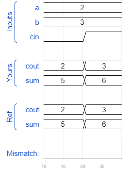

# Adder3
### Solution
```Verilog
module top_module( 
    input [2:0] a, b,
    input cin,
    output [2:0] cout,
    output [2:0] sum );
    
    assign cout[0] = a[0] & b[0] | a[0] & cin | b[0] & cin;
    assign sum[0]  = a[0] ^ b[0] ^ cin;
    
    genvar i;
    generate 
        for(i = 1; i < 3; i = i + 1) begin : forloop
            assign cout[i] = a[i] & b[i] | a[i] & cout[i-1] | b[i] & cout[i-1];
    		assign sum[i]  = a[i] ^ b[i] ^ cout[i-1];
        end 
    endgenerate

endmodule
```
[code](./68.v)

### Timing diagrams for selected test cases

