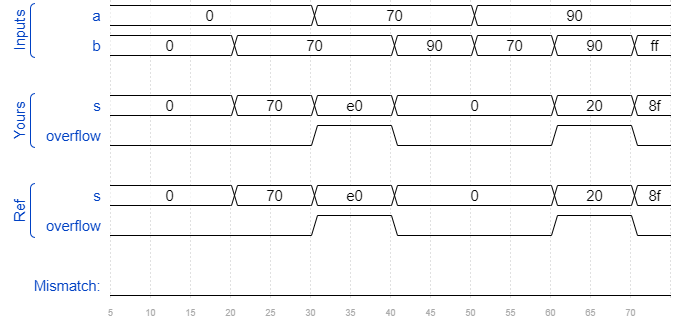

# Exams/ece241 2014 q1c
### Solution
```Verilog
module top_module (
    input [7:0] a,
    input [7:0] b,
    output [7:0] s,
    output overflow
);
 
	assign s = a + b;
	assign overflow = (a[7] == b[7] && a[7] != s[7]) ? 1 : 0;

endmodule
```
[code](./70.v)

### Timing diagrams for selected test cases
