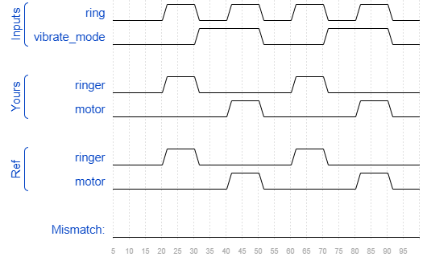

# Ringer
### Solution
```Verilog
module top_module (
    input ring,
    input vibrate_mode,
    output ringer,       // Make sound
    output motor         // Vibrate
);
    assign {ringer, motor} = ring ? (vibrate_mode ? {1'b0, 1'b1} : {1'b1, 1'b0}) : {1'b0, 1'b0};

endmodule
```
[code](./56.v)

### Timing diagrams for selected test cases
