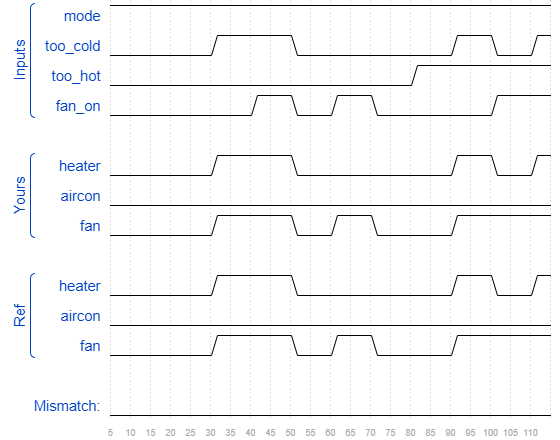

# Thermostat
### Solution
```Verilog
module top_module (
    input too_cold,
    input too_hot,
    input mode,
    input fan_on,
    output heater,
    output aircon,
    output fan
); 
    assign heater = mode & too_cold;
    assign aircon = ~mode & too_hot;
    assign fan = fan_on | heater | aircon;

endmodule
```
[code](./57.v)

### Timing diagrams for selected test cases
