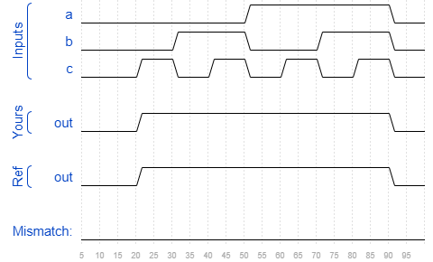

# Kmap1
### Solution
```Verilog
module top_module(
    input a,
    input b,
    input c,
    output out  ); 
    
    assign out = a | b | c;

endmodule
```
[code](./73.v)

### Timing diagrams for selected test cases
