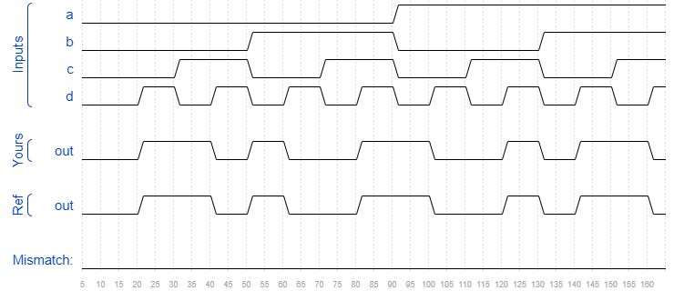

# Kmap4
### Solution
```Verilog
module top_module(
    input a,
    input b,
    input c,
    input d,
    output out  ); 
    
    assign out = (~a & b & ~c & ~d) | (a & ~b & ~c & ~d) | (~a & ~b & ~c & d) | (a & b & ~c & d) | (~a & b & c & d) | (a & ~b & c & d) | (~a & ~b & c & ~d) | (a & b & c & ~d);

endmodule
```
[code](./76.v)

### Timing diagrams for selected test cases
