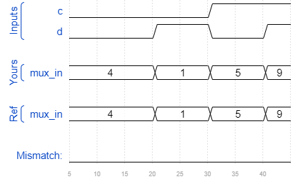

# Exams/ece241 2014 q3
### Solution
```Verilog
module top_module (
    input c,
    input d,
    output [3:0] mux_in
);  
    assign mux_in[0] = c | d;
    assign mux_in[1] = 1'b0;
    assign mux_in[2] = ~d;
    assign mux_in[3] = c & d;

endmodule
```
[code](./80.v)

### Timing diagrams for selected test cases
