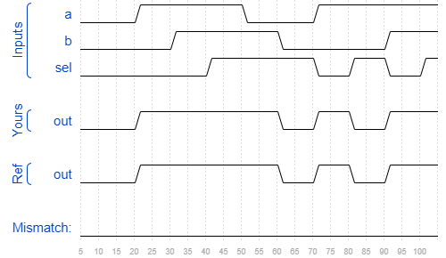

# Mux2to1
### Solution
```Verilog
module top_module( 
    input a, b, sel,
    output out ); 
    
    assign out = (sel == 1'b0) ? a : b;

endmodule
```
[code](./61.v)

### Timing diagrams for selected test cases
