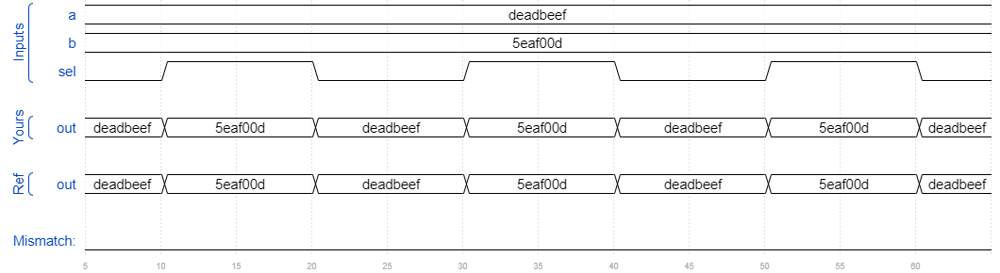

# Mux2to1v
### Solution
```Verilog
module top_module( 
    input [99:0] a, b,
    input sel,
    output [99:0] out );
    
    assign out = (sel == 1'b0) ? a : b;

endmodule
```
[code](./62.v)

### Timing diagrams for selected test cases
