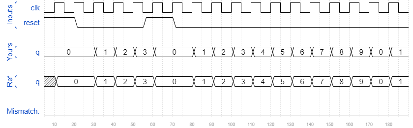

# Count10
### Solution
```Verilog
module top_module (
    input clk,
    input reset,        // Synchronous active-high reset
    output reg [3:0] q);
    
    always @(posedge clk) begin
        if(reset || q == 4'd9)
            q <= 4'b0;
        else
            q <= q + 4'b1;
    end

endmodule
```
[code](./100.v)

### Timing diagrams for selected test cases
