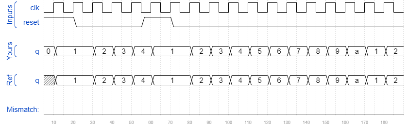

# Count1to10
### Solution
```Verilog
module top_module (
    input clk,
    input reset,
    output reg [3:0] q);
    
    always @(posedge clk) begin
        if(reset || q == 4'd10)
            q <= 4'd1;
        else
            q <= q + 4'd1;
    end

endmodule
```
[code](./101.v)

### Timing diagrams for selected test cases
