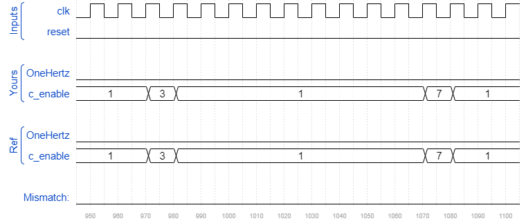

# Exams/ece241 2014 q7b
### Solution
```Verilog
module top_module (
    input clk,
    input reset,
    output OneHertz,
    output [2:0] c_enable
); //

    wire [3:0] digit_0, digit_1, digit_2;
    
    bcdcount counter0 (clk, reset, c_enable[0], digit_0);
    bcdcount counter1 (clk, reset, c_enable[1], digit_1);
    bcdcount counter2 (clk, reset, c_enable[2], digit_2);
    
    assign c_enable = {(digit_1 == 4'd9) & (digit_0 == 4'd9), digit_0 == 4'd9, 1'b1};
    assign OneHertz = (digit_0 == 4'd9) && (digit_1 == 4'd9) && (digit_2 == 4'd9);

endmodule
```
[code](./104.v)

### Timing diagrams for selected test cases





