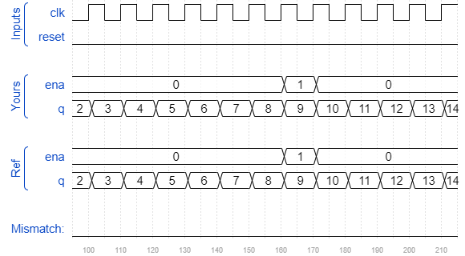

# Countbcd
### Solution
```Verilog
module top_module (
    input clk,
    input reset,   // Synchronous active-high reset
    output [3:1] ena,
    output [15:0] q);
    
    assign ena[1] = q[3:0] == 4'd9;
    assign ena[2] = q[7:4] == 4'd9 && ena[1];
    assign ena[3] = q[11:8] == 4'd9 && ena[2];
    
    BCD_counter BCD_1(.clk(clk), .reset(reset), .enable(1'b1), .q(q[3:0]));
    BCD_counter BCD_2(.clk(clk), .reset(reset), .enable(ena[1]), .q(q[7:4]));
    BCD_counter BCD_3(.clk(clk), .reset(reset), .enable(ena[2]), .q(q[11:8]));
    BCD_counter BCD_4(.clk(clk), .reset(reset), .enable(ena[3]), .q(q[15:12]));

endmodule

module BCD_counter(
    input clk,
    input reset,
    input enable,
    output reg [3:0] q
);

    always @(posedge clk) begin
        if(reset || (enable && q == 4'd9))
            q <= 4'd0;
        else if(enable)
            q <= q + 4'd1;
        else
            q <= q;
    end
    
endmodule
```
[code](./105.v)

### Timing diagrams for selected test cases

