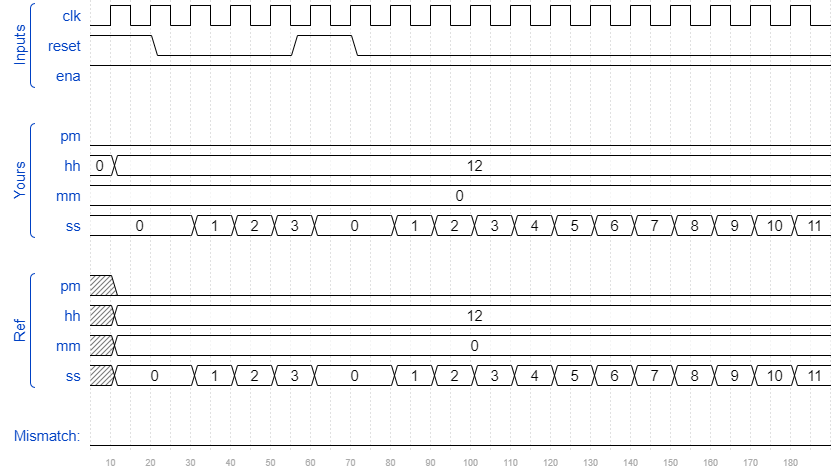
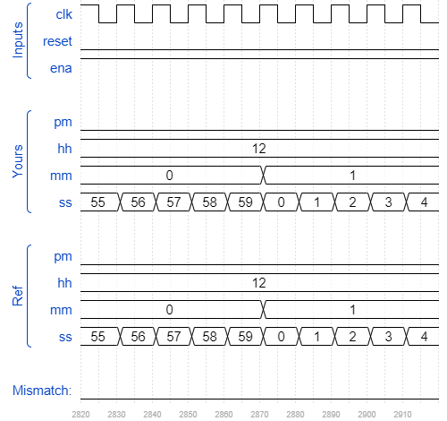
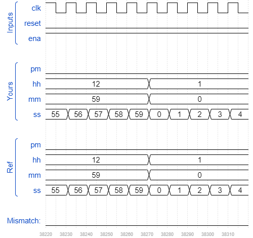
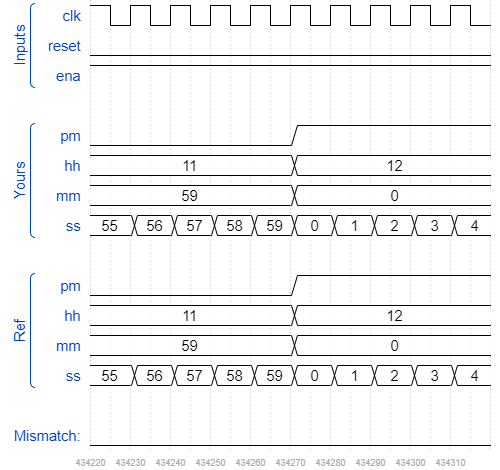

# Count clock
### Solution
```Verilog
module top_module(
    input clk,
    input reset,
    input ena,
    output reg pm,
    output [7:0] hh,
    output [7:0] mm,
    output [7:0] ss); 
    
    wire ena_mm, ena_hh;
    
    assign ena_mm = ss == 8'h59 && ena;
    assign ena_hh = ena_mm && mm == 8'h59;
    
    Counter SS(.clk(clk), .reset(reset), .reset_num(8'h0), .enable(ena), .cnt(8'h59), .q(ss));
    Counter MM(.clk(clk), .reset(reset), .reset_num(8'h0), .enable(ena_mm), .cnt(8'h59), .q(mm));
    Counter HH(.clk(clk), .reset(reset), .reset_num(8'h12), .enable(ena_hh), .cnt(8'h12), .q(hh));
    
    always @(posedge clk) begin
        if(reset)
        	pm <= 1'b0;
        else
            pm <= (ss == 8'h59 && mm == 8'h59 && hh == 8'h11) ? ~pm : pm;
    end

endmodule

module Counter(
    input clk,
    input reset,
    input [7:0] reset_num,
    input enable,
    input [7:0] cnt,
    output reg [7:0] q
);
    always @(posedge clk) begin
        if(reset)
            q <= reset_num;
        else if(enable && q == cnt) begin
            if(cnt == 8'h59)
                q <= 8'h0;
            else
                q <= 8'h1;
        end
        else if(enable) begin
            if(q[3:0] == 8'h9) begin
                q[7:4] <= q[7:4] + 8'h1;
                q[3:0] <= 8'h0;
            end
            else
                q <= q + 8'h1;
        end
        else
            q <= q;
    end
    
endmodule
```
[code](./106.v)

### Timing diagrams for selected test cases






