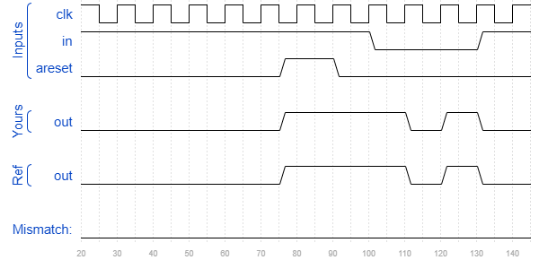

# Fsm1
### Solution
```Verilog
module top_module(
    input clk,
    input areset,    // Asynchronous reset to state B
    input in,
    output out);//  

    parameter A=0, B=1; 
    reg state, next_state;

    always @(*) begin    // This is a combinational always block
        // State transition logic
        case(state)
            A : next_state <= (in == 0) ? B : A;  
            B : next_state <= (in == 0) ? A : B; 
           default: next_state <= B;
        endcase
    end

    always @(posedge clk, posedge areset) begin    // This is a sequential always block
        // State flip-flops with asynchronous reset
        if(areset)
            state <= B;
        else
            state <= next_state;
    end

    // Output logic
    // assign out = (state == ...);
    assign out = state == A ? 1'b0 : 1'b1;

endmodule
```
[code](./119.v)

### Timing diagrams for selected test cases
