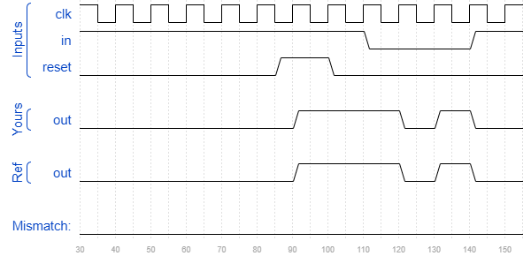

# Fsm1s
### Solution
```Verilog
// Note the Verilog-1995 module declaration syntax here:
module top_module(clk, reset, in, out);
    input clk;
    input reset;    // Synchronous reset to state B
    input in;
    output out;//

    parameter A=0, B=1; 
    reg state, next_state;

    always @(*) begin
        case(state)
            A : next_state <= (in == 0) ? B : A;  
            B : next_state <= (in == 0) ? A : B; 
           default: next_state <= B;
        endcase
    end

    always @(posedge clk) begin
        if(reset)
            state <= B;
        else
            state <= next_state;
    end

    assign out = state == A ? 1'b0 : 1'b1;

endmodule
```
[code](./120.v)

### Timing diagrams for selected test cases
