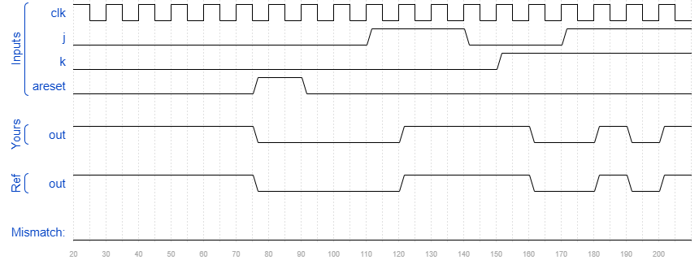

# Fsm2
### Solution
```Verilog
module top_module(
    input clk,
    input areset,    // Asynchronous reset to OFF
    input j,
    input k,
    output out); //  

    parameter OFF=0, ON=1; 
    reg state, next_state;

    always @(*) begin
        // State transition logic
        case(state)
            OFF : next_state <= (j == 0) ? OFF : ON;
            ON : next_state <= (k == 0) ? ON : OFF;
            default: next_state <= OFF;
        endcase
    end

    always @(posedge clk, posedge areset) begin
        // State flip-flops with asynchronous reset
        if(areset)
            state <= OFF;
        else
            state <= next_state;
    end

    // Output logic
    // assign out = (state == ...);
    assign out = (state == OFF) ? 1'b0 : 1'b1;

endmodule
```
[code](./121.v)

### Timing diagrams for selected test cases
