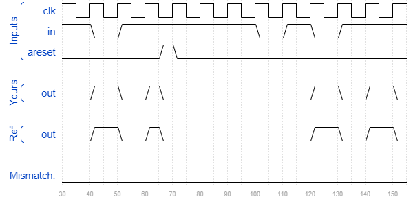

# Fsm3
### Solution
```Verilog
module top_module(
    input clk,
    input in,
    input areset,
    output out); //

    reg [1:0] state, next_state;
    parameter A=2'b00, B=2'b01, C=2'b10, D=2'b11;
    
    // State transition logic
    always @(*) begin
        case(state)
            A : next_state <= (in == 0) ? A : B;
            B : next_state <= (in == 0) ? C : B;
            C : next_state <= (in == 0) ? A : D;
            D : next_state <= (in == 0) ? C : B;
            default: next_state <= A;
        endcase
    end

    // State flip-flops with asynchronous reset
    always @(posedge clk or posedge areset) begin
        if(areset)
            state <= A;
        else
            state <= next_state;
    end

    // Output logic
    assign out = (state == D) ? 1'b1 : 1'b0;

endmodule
```
[code](./125.v)

### Timing diagrams for selected test cases
