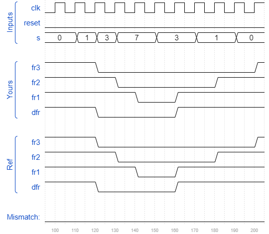

# Exams/ece241 2013 q4
### Solution
```Verilog
module top_module (
    input clk,
    input reset,
    input [3:1] s,
    output fr3,
    output fr2,
    output fr1,
    output reg dfr
); 
    reg [2:0] out_fr;
    reg [1:0] state, next_state;
    parameter S1=2'b00, S2=2'b01, S3=2'b10, S4=2'b11;
    
    always @(posedge clk) begin
        if(reset) begin
            state <= S1;
            dfr <= 1'b1;
        end
        else begin
            state <= next_state;
            
            if(next_state > state)
                dfr <= 1'b0;
            else if(next_state < state)
                dfr <= 1'b1;
            else
                dfr <= dfr;
        end
    end
    
    always @(*) begin
        case(s)
            3'b000 : next_state <= S1;
            3'b001 : next_state <= S2;
            3'b011 : next_state <= S3;
            3'b111 : next_state <= S4;
			default: next_state <= S1;
        endcase
    end
    
    assign {fr3, fr2, fr1} = out_fr;
    always @(posedge clk) begin
        if(reset)
            out_fr <= 3'b111;
        else begin
            case(next_state)
                S1 : out_fr <= 3'b111;
                S2 : out_fr <= 3'b011;
                S3 : out_fr <= 3'b001;
                S4 : out_fr <= 3'b000;
                default: out_fr <= 3'b111;
            endcase
        end 
    end

endmodule
```
[code](./127.v)

### Timing diagrams for selected test cases
