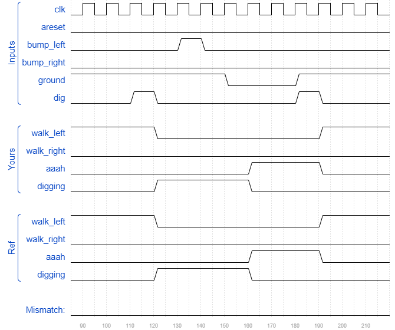

# Lemmings3
### Solution
```Verilog
module top_module(
    input clk,
    input areset,    // Freshly brainwashed Lemmings walk left.
    input bump_left,
    input bump_right,
    input ground,
    input dig,
    output walk_left,
    output walk_right,
    output aaah,
    output digging );
    
    parameter LEFT_GND=3'b000, RIGHT_GND=3'b001, LEFT_AAAH=3'b010, RIGHT_AAAH=3'b011, LEFT_DIG=3'b100, RIGHT_DIG=3'b101;
    reg [2:0] state, next_state;
    
    always @(posedge clk or posedge areset) begin
        if(areset)
            state <= LEFT_GND;
        else
            state <= next_state;
    end
    
    always @(*) begin
        case(state)
            LEFT_GND : next_state <= ground ? (dig ? LEFT_DIG : (bump_left ? RIGHT_GND : LEFT_GND)) : LEFT_AAAH;
            RIGHT_GND : next_state <= ground ? (dig ? RIGHT_DIG : (bump_right ? LEFT_GND : RIGHT_GND)) : RIGHT_AAAH;
            LEFT_AAAH : next_state <= ground ? LEFT_GND : LEFT_AAAH;
            RIGHT_AAAH : next_state <= ground ? RIGHT_GND : RIGHT_AAAH;
            LEFT_DIG : next_state <= ground ? LEFT_DIG : LEFT_AAAH;
            RIGHT_DIG : next_state <= ground ? RIGHT_DIG : RIGHT_AAAH;
            default: next_state <= LEFT_GND;
        endcase
    end
    
    assign walk_left = (state == LEFT_GND) ? 1'b1 : 1'b0;
    assign walk_right = (state == RIGHT_GND) ? 1'b1 : 1'b0;
    assign aaah = (state == LEFT_AAAH || state == RIGHT_AAAH) ? 1'b1 : 1'b0;
    assign digging = (state == LEFT_DIG || state == RIGHT_DIG) ? 1'b1 : 1'b0;

endmodule
```
[code](./130.v)

### Timing diagrams for selected test cases
