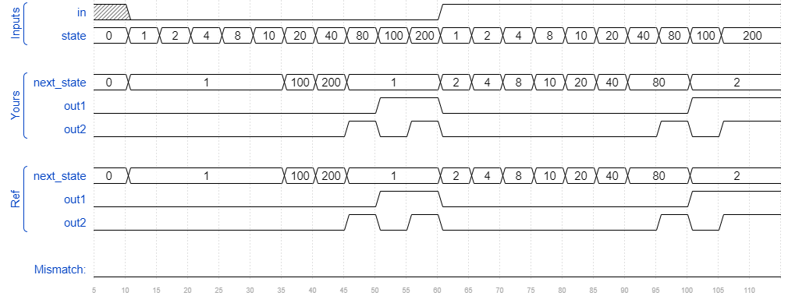

# Fsm onehot
### Solution
```Verilog
module top_module(
    input in,
    input [9:0] state,
    output [9:0] next_state,
    output out1,
    output out2);
    
    parameter S0=0, S1=1, S2=2, S3=3, S4=4, S5=5, S6=6, S7=7, S8=8, S9=9;
    
    assign next_state[S0] = ~in & (state[S0] | state[S1] | state[S2] | state[S3] | state[S4] | state[S7] | state[S8] | state[S9]);
    assign next_state[S1] = in & (state[S0] | state[S8] | state[S9]);
    assign next_state[S2] = in & state[S1];
    assign next_state[S3] = in & state[S2];
    assign next_state[S4] = in & state[S3];
    assign next_state[S5] = in & state[S4];
    assign next_state[S6] = in & state[S5];
    assign next_state[S7] = in & (state[S6] | state[7]);
    assign next_state[S8] = ~in & state[S5];
    assign next_state[S9] = ~in & state[S6];
    
    assign out1 = state[S8] | state[S9];
    assign out2 = state[S7] | state[S9];

endmodule
```
[code](./132.v)

### Timing diagrams for selected test cases
