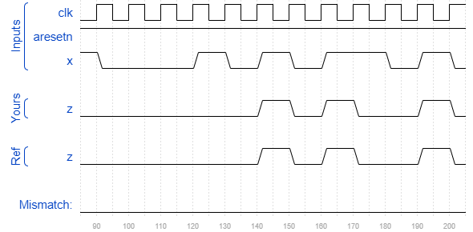

# Exams/ece241 2013 q8
### Solution
```Verilog
module top_module (
    input clk,
    input aresetn,    // Asynchronous active-low reset
    input x,
    output reg z ); 
    
    parameter S0=0, S1=1, S2=2;
    reg [1:0] state, next_state;
    
    always @(posedge clk or negedge aresetn) begin
        if(~aresetn)
            state <= S0;
        else
            state <= next_state;
    end
    
    always @(*) begin
        case(state)
            S0 : begin
                next_state <= x ? S1 : S0;
                z <= 1'b0;
            end
            S1 : begin
                next_state <= x ? S1 : S2;
                z <= 1'b0;
            end
            S2 : begin
                next_state <= x ? S1 : S0;
                z <= x ? 1'b1 : 1'b0;
            end
        endcase
    end

endmodule
```
[code](./139.v)

### Timing diagrams for selected test cases
