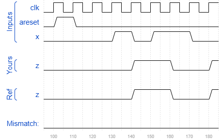

# Exams/ece241 2014 q5a
### Solution
```Verilog
module top_module (
    input clk,
    input areset,
    input x,
    output z
); 
    parameter S0=0, S1=1, S2=2;
    reg [1:0] state, next_state;
    
    always @(posedge clk or posedge areset) begin
        if(areset)
            state <= S0;
        else
            state <= next_state;
    end
    
    always @(*) begin
        case(state)
            S0 : next_state <= x ? S1 : S0;
            S1 : next_state <= x ? S2 : S1;
            S2 : next_state <= x ? S2 : S1;
            default: next_state <= S0;
        endcase
    end
    
    assign z = state == S1;

endmodule
```
[code](./140.v)

### Timing diagrams for selected test cases
