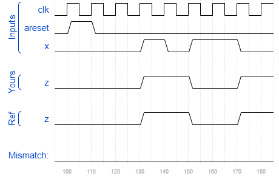

# Exams/ece241 2014 q5b
### Solution
```Verilog
module top_module (
    input clk,
    input areset,
    input x,
    output reg z
); 
    
    parameter A=0, B=1;
    reg state, next_state;
    
    always @(posedge clk or posedge areset) begin
        if(areset)
            state <= A;
        else
            state <= next_state;
    end
    
    always @(*) begin
        case(state)
            A : begin 
                next_state <= x ? B : A;
                z <= x ? 1'b1 : 1'b0;
            end
            B : begin
                next_state <= B;
                z <= x ? 1'b0 : 1'b1;
            end
            default: begin
                next_state <= A;
                z <= 1'b0;
            end
        endcase
    end

endmodule
```
[code](./141.v)

### Timing diagrams for selected test cases
