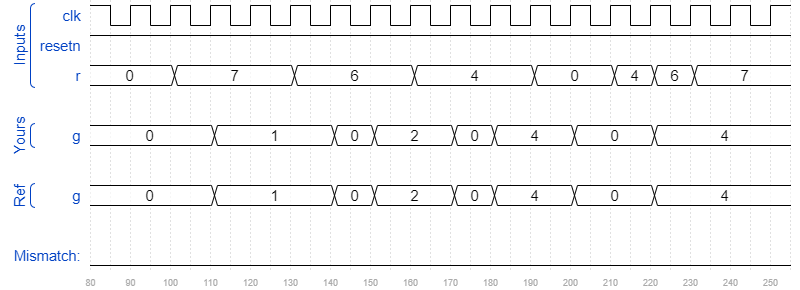

# Exams/2013 q2afsm
### Solution
```Verilog
module top_module (
    input clk,
    input resetn,    // active-low synchronous reset
    input [3:1] r,   // request
    output [3:1] g   // grant
); 
    parameter A=2'b00, B=2'b01, C=2'b10, D=2'b11;
    reg [1:0] state, next_state;
    
    always @(posedge clk) begin
        if(~resetn) 
            state <= A;
        else
            state <= next_state;
    end
    
    always @(*) begin
        case(state)
            A : next_state <= r[1] ? B : (~r[1] && r[2] ? C : (~r[1] && ~r[2] && r[3] ? D : A));
            B : next_state <= r[1] ? B : A;
            C : next_state <= r[2] ? C : A;
            D : next_state <= r[3] ? D : A;
            default: next_state <= A;
        endcase
    end
    
    assign g = {(state == D), (state == C), (state == B)};

endmodule
```
[code](./150.v)

### Timing diagrams for selected test cases
