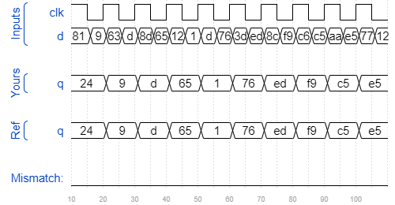

# Dff8
### Solution
```Verilog
module top_module (
    input clk,
    input [7:0] d,
    output reg [7:0] q
);
    
    always @(posedge clk) begin
        q <= d;
    end

endmodule
```
[code](./82.v)

### Timing diagrams for selected test cases
