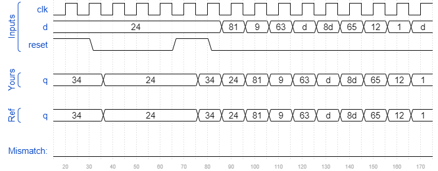

# Dff8p
### Solution
```Verilog
module top_module (
    input clk,
    input reset,
    input [7:0] d,
    output reg [7:0] q
);
    always @(negedge clk) begin
        if(reset)
            q <= 8'h34;
        else
            q <= d;
    end

endmodule
```
[code](./84.v)

### Timing diagrams for selected test cases
