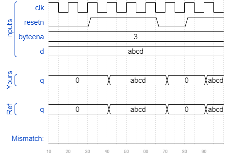
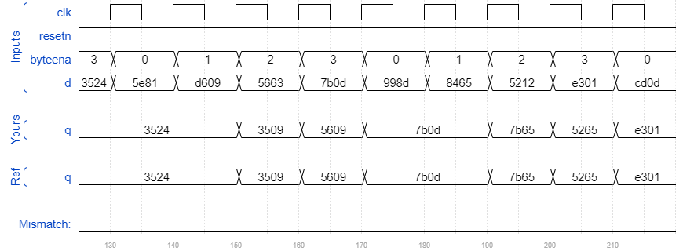

# Dff16e
### Solution
```Verilog
module top_module (
    input clk,
    input resetn,
    input [1:0] byteena,
    input [15:0] d,
    output reg [15:0] q
);
    always @(posedge clk) begin
        if(~resetn)
            q <= 16'b0;
        else begin
            q[15:8] <= byteena[1] ? d[15:8] : q[15:8];
            q[7:0] <= byteena[0] ? d[7:0] : q[7:0];
        end
    end

endmodule
```
[code](./86.v)

### Timing diagrams for selected test cases


