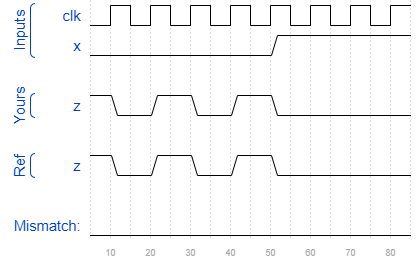

# Exams/ece241 2014 q4
### Solution
```Verilog
module top_module (
    input clk,
    input x,
    output z
); 
	wire d1, d2, d3, q1, q2, q3;
    
    assign d1 = x ^ q1;
    assign d2 = x & ~q2;
    assign d3 = x | ~q3;
    
    D_FF dff1(.clk(clk), .d(d1), .q(q1));
    D_FF dff2(.clk(clk), .d(d2), .q(q2));
    D_FF dff3(.clk(clk), .d(d3), .q(q3));

    assign z = ~(q1 | q2 | q3);

endmodule

module D_FF(
    input clk, 
    input d, 
    output reg q
);
    
    always @(posedge clk) begin
        q <= d;
    end
    
endmodule
```
[code](./93.v)

### Timing diagrams for selected test cases
