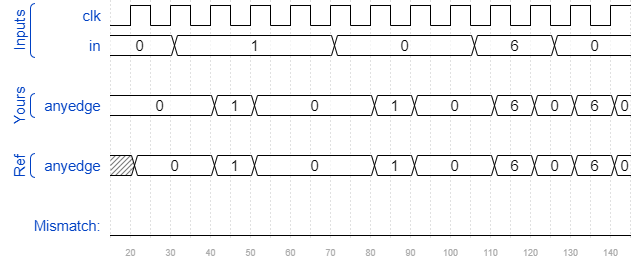

# Edgedetect2
### Solution
```Verilog
module top_module (
    input clk,
    input [7:0] in,
    output reg [7:0] anyedge
);
    reg [7:0] in_state;
    
    always @(posedge clk) begin
        in_state <= in;
        anyedge <= in ^ in_state;
    end

endmodule
```
[code](./96.v)

### Timing diagrams for selected test cases
