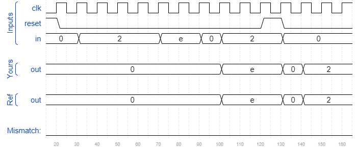
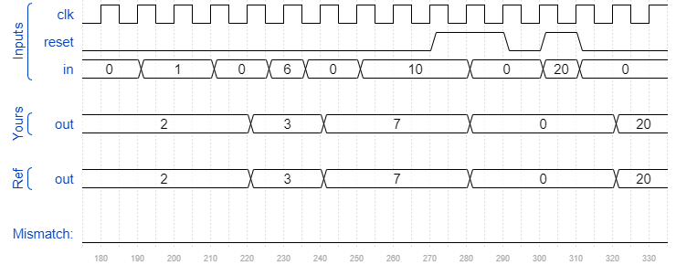

# Edgecapture
### Solution
```Verilog
module top_module (
    input clk,
    input reset,
    input [31:0] in,
    output reg [31:0] out
);
    reg [31:0] in_state;
    
    always @(posedge clk) begin
        in_state <= in;
        
        if(reset)
            out <= 32'b0;
        else
            out <= out | (~in & in_state);
    end

endmodule
```
[code](./97.v)

### Timing diagrams for selected test cases


