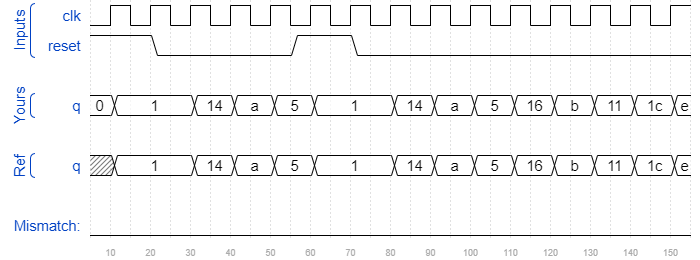

# Lfsr5
### Solution
```Verilog
module top_module(
    input clk,
    input reset,    // Active-high synchronous reset to 5'h1
    output reg [4:0] q
); 
    always @(posedge clk) begin
        if(reset)
            q <= 5'b1;
        else
            q <= {1'b0 ^ q[0], q[4], q[3] ^ q[0], q[2], q[1]};
    end

endmodule
```
[code](./110.v)

### Timing diagrams for selected test cases
