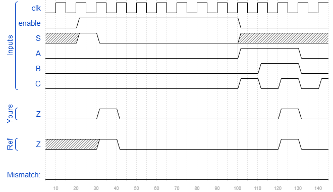

# Exams/ece241 2013 q12
### Solution
```Verilog
module top_module (
    input clk,
    input enable,
    input S,
    input A, B, C,
    output Z ); 
    
    reg [7:0] q;
    
    always @(posedge clk) begin
        if(enable)
            q <= {q[6:0], S};
        else
            q <= q;
    end
    
    assign Z = q[{A, B, C}];

endmodule
```
[code](./115.v)

### Timing diagrams for selected test cases
