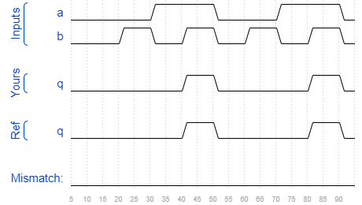

# Sim/circuit1
### Solution
```Verilog
module top_module (
    input a,
    input b,
    output q );//

    assign q = a & b; // Fix me

endmodule
```
[code](./164.v)

### Timing diagrams for selected test cases
