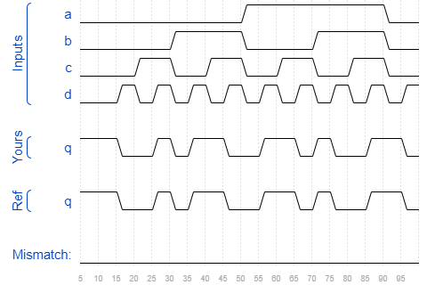

# Sim/circuit2
### Solution
```Verilog
module top_module (
    input a,
    input b,
    input c,
    input d,
    output q );//

    assign q = (~a & ~b & ~c & ~d) | (~a & ~b & c & d) | (~a & b & ~c & d) | (~a & b & c & ~d) | (a & ~b & ~c & d) | (a & ~b & c & ~d) | (a & b & ~c & ~d) | (a & b & c & d); // Fix me

endmodule
```
[code](./165.v)

### Timing diagrams for selected test cases
