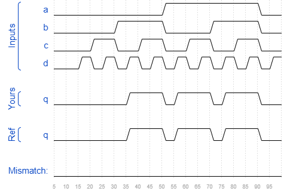

# Sim/circuit3
### Solution
```Verilog
module top_module (
    input a,
    input b,
    input c,
    input d,
    output q );//

    assign q = (b & d) | (b & c) | (a & d) | (a & c); // Fix me

endmodule
```
[code](./166.v)

### Timing diagrams for selected test cases
