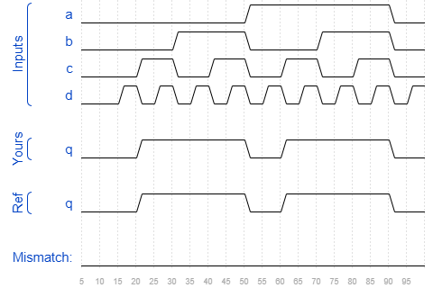

# Sim/circuit4
### Solution
```Verilog
module top_module (
    input a,
    input b,
    input c,
    input d,
    output q );//

    assign q = b | c; // Fix me

endmodule
```
[code](./167.v)

### Timing diagrams for selected test cases
