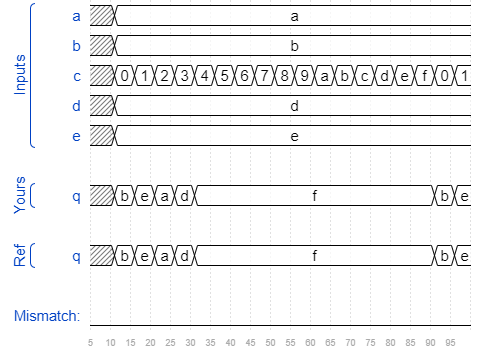

# Sim/circuit5
### Solution
```Verilog
module top_module (
    input [3:0] a,
    input [3:0] b,
    input [3:0] c,
    input [3:0] d,
    input [3:0] e,
    output reg [3:0] q );
    
    always @(*) begin
        case(c)
            4'd0 : q <= b;
            4'd1 : q <= e;
            4'd2 : q <= a;
            4'd3 : q <= d;
            default: q <= 4'hf;
        endcase
    end

endmodule
```
[code](./168.v)

### Timing diagrams for selected test cases



