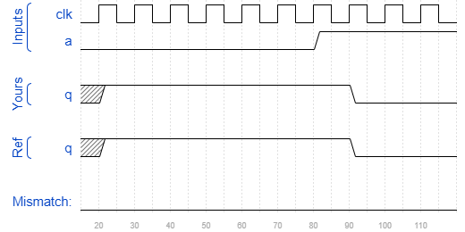

# Sim/circuit7
### Solution
```Verilog
module top_module (
    input clk,
    input a,
    output reg q );

    always @(posedge clk) begin
        q <= ~a;
    end
    
endmodule
```
[code](./170.v)

### Timing diagrams for selected test cases

