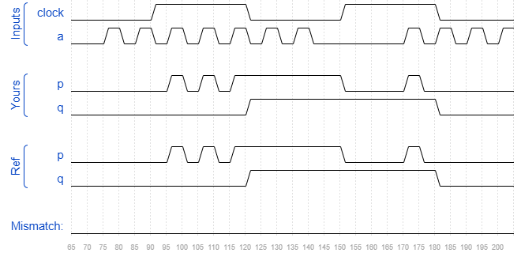

# Sim/circuit8
### Solution
```Verilog
module top_module (
    input clock,
    input a,
    output reg p,
    output reg q );
    
    always @(*) begin
        p <= clock ? a : p;
    end
    
    always @(negedge clock) begin
        q <= p;
    end

endmodule
```
[code](./171.v)

### Timing diagrams for selected test cases

