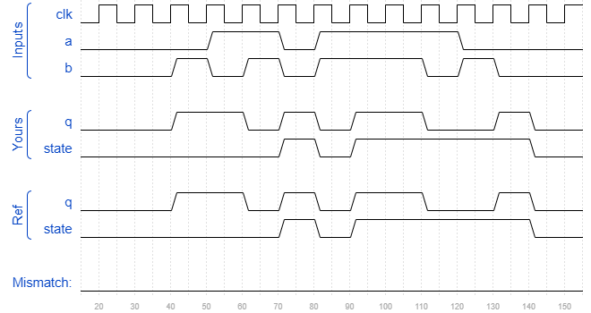

# Sim/circuit10
### Solution
```Verilog
module top_module (
    input clk,
    input a,
    input b,
    output q,
    output reg state  );
    
    always @(posedge clk) begin
        state <= a == b ? a : state;
    end
    
    assign q = a == b ? state : ~state;

endmodule
```
[code](./173.v)

### Timing diagrams for selected test cases

