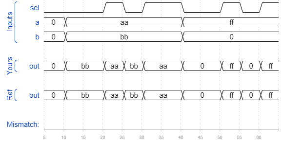

# Bugs mux2
### Solution
```Verilog
module top_module (
    input sel,
    input [7:0] a,
    input [7:0] b,
    output [7:0] out  );

    assign out = sel ? a : b;

endmodule
```
[code](./159.v)

### Timing diagrams for selected test cases
