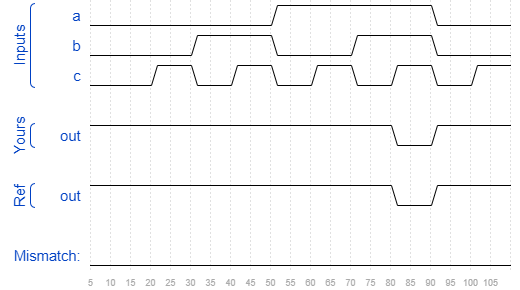

# Bugs nand3
### Solution
```Verilog
module top_module (input a, input b, input c, output out);//

    wire temp;
    assign out = ~temp;
    
    andgate inst1(.out(temp), .a(a), .b(b), .c(c), .d(1'b1), .e(1'b1));

endmodule
```
[code](./160.v)

### Timing diagrams for selected test cases
