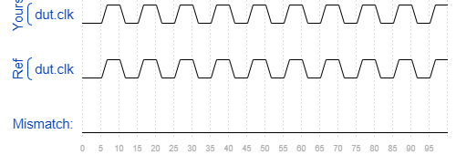

# Tb/clock
### Solution
```Verilog
module top_module ( );
    parameter time_period = 10;
    reg clk;
    initial clk = 0;
    
    always begin
        #(time_period / 2) clk = ~clk;
    end
    
    dut DUT0(.clk(clk));
    
endmodule
```
[code](./174.v)

### Timing diagrams for selected test cases
