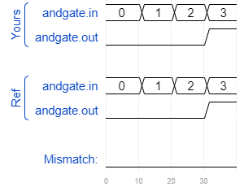

# Tb/and
### Solution
```Verilog
module top_module();
    
    reg [1:0] in;
    reg out;
    
    initial begin
        #0 in = 2'b00; 
        #10 in = 2'b01;
        #10 in = 2'b10;
        #10 in = 2'b11;
    end
    
    andgate AND(.in(in), .out(out));

endmodule
```
[code](./176.v)

### Timing diagrams for selected test cases
