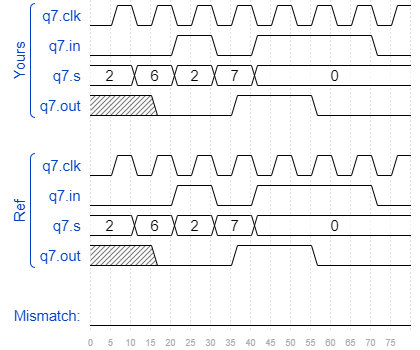

# Tb/tb2
### Solution
```Verilog
module top_module();
    
    reg clk, in, out;
    reg [2:0] s;
    
    initial begin
        clk <= 1'b0;
        in <= 1'b0;
        s <= 3'd2;
        
        #10 s <= 3'd6;
        #10;
        in <= 1'b1;
        s <= 3'd2;
        #10;
        in <= 1'b0;
        s <= 3'd7;
        #10;
        in <= 1'b1;
        s <= 3'd0;
        #30 in <= 1'b0;
    end
    
    always begin
        #5 clk = ~clk;
    end
    
    q7 Q7(.clk(clk), .in(in), .s(s), .out(out));

endmodule
```
[code](./177.v)

### Timing diagrams for selected test cases
