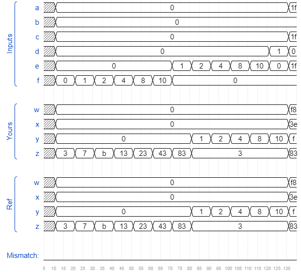

# Vector3
### Solution
```Verilog
module top_module (
    input [4:0] a, b, c, d, e, f,
    output [7:0] w, x, y, z
);
    assign {w, x, y, z} = {a, b, c, d, e, f, 2'b11};
endmodule
```
[code](./16.v)

### Timing diagrams for selected test cases

